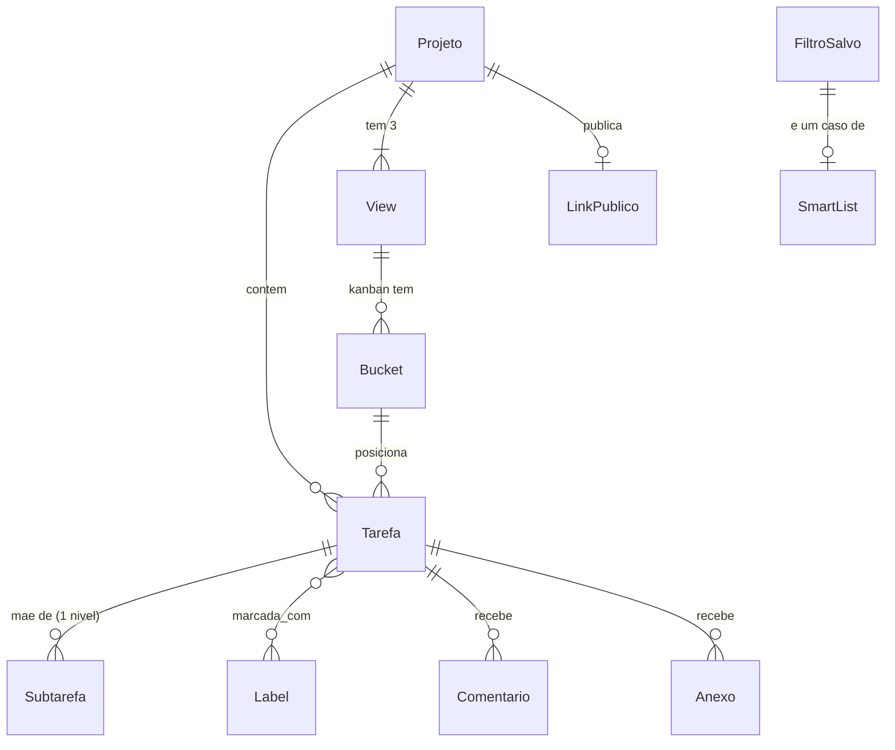

# projMan

Gestor de projetos e tarefas de uso próprio, auto-hospedado, inspirado nas
funcionalidades do Vikunja. Usuário único: não há conta, time ou atribuição de
tarefas a alguém. Este glossário é o vocabulário do domínio; detalhe de decisão
fica em `docs/decisoes/NN-*.md`.

## Language

### Núcleo

**Projeto**:
Um contêiner plano de Tarefas, com cor e posição próprias na sidebar.
Projetos não se aninham — não existe Subprojeto.

**Projeto Arquivado**:
Um Projeto marcado `archived`, tirado de toda Smart List, Filtro Salvo e do
Feed de Calendário, mas ainda acessível numa seção recolhida da sidebar.
Arquivar não apaga nada; é a alternativa a apagar (`docs/decisoes/09-schema.md`).
_Não confundir com_: apagar — apagar um Projeto é físico e definitivo, sem
lixeira nem retenção.

**Tarefa**:
A unidade de trabalho: título, descrição rica, Prazo, Prioridade, Labels,
Comentários, Anexos e posição dentro de cada View do seu Projeto.

**Subtarefa**:
Uma Tarefa com mãe, restrita a **um nível só** — a mãe não pode ela mesma ser
Subtarefa, e ambas vivem no mesmo Projeto. Fora de uma lista filtrada por sua
própria mãe, uma Subtarefa aparece solta, com o título da mãe ao lado.
_Não confundir com_: hierarquia de Projetos — não existe; só Tarefas têm mãe.

**Prazo**:
O instante em que uma Tarefa vence. Pode ser um **dia inteiro** (dia civil,
sem hora, fuso do servidor) ou um instante exato com hora. Determina em quais
Smart Lists a Tarefa aparece e se ela entra no Feed de Calendário.

**Prioridade**:
Uma escala ordenada de 0 a 5: 0 sem prioridade, 1 baixa, 2 média, 3 alta,
4 urgente, 5 agora. É ordenada, não um conjunto de rótulos — "alta ou
urgente" é uma faixa (`prioridadeMin`), nunca um OR entre valores.
_Não confundir com_: Label — Prioridade é um campo escalar da Tarefa, Label é
uma marcação livre e multivalorada.

**Tarefa Feita**:
Uma Tarefa com `done = true`. Marcar feita é uma operação única e central:
grava a conclusão, move a Tarefa para o Bucket de Feitas em toda View Kanban,
e — se a Tarefa tem Recorrência — calcula o próximo Prazo e reabre a Tarefa e
suas Subtarefas diretas em vez de mantê-la feita.
_Não confundir com_: Bucket de Feitas — uma Tarefa pode estar nesse Bucket
apenas porque foi arrastada; o campo `done` é a fonte da verdade.

**Recorrência**:
Uma regra opcional de repetição (quantidade + unidade: dia/semana/mês/ano)
numa Tarefa. O próximo Prazo é sempre calculado a partir do **Prazo anterior**,
nunca da data em que a Tarefa foi marcada feita, com ajuste ao fim do mês e
salto de ciclos já vencidos. Não existe histórico de ocorrências passadas —
a mesma Tarefa avança.

### Organização e views

**View**:
Uma das três formas fixas de olhar as Tarefas de um Projeto: **List**, **Kanban**
e **Table**. Todo Projeto nasce com as três; não há criação, edição ou remoção
de View.

**Bucket**:
Uma coluna de uma View Kanban. Todo Projeto nasce com três: **A fazer**,
**Fazendo** e **Feito** — o **Bucket de Feitas** é o último, ligado
bidirecionalmente ao estado Tarefa Feita: arrastar uma Tarefa para ele marca
`done`, e marcar feita por qualquer caminho move o card para ele. Um Bucket
tem um limite WIP opcional que só sinaliza visualmente; nunca bloqueia o
drop.
_Não confundir com_: Tarefa Feita — ver acima.

**Posição**:
A ordem de uma Tarefa dentro de uma View (List/Table) ou dentro de um Bucket
(Kanban). É um número real, atribuído por ponto médio entre os vizinhos ao
inserir ou mover; renumeração inteira do conjunto acontece só quando o
espaçamento fica pequeno demais.

### Metadados e busca

**Label**:
Uma marcação livre, global (não presa a um Projeto), com título único e cor,
aplicável a qualquer Tarefa em qualquer quantidade.
_Não confundir com_: Projeto — uma Tarefa pertence a exatamente um Projeto,
mas pode ter zero ou várias Labels.

**Smart List**:
Um dos cinco recortes fixos e pré-definidos de Tarefas abertas: **Hoje**,
**7 dias**, **Atrasadas**, **Sem prazo** e **Todas as abertas**. Cada Smart
List é, por baixo, um Filtro Salvo predefinido — não existe mecanismo
separado.
_Não confundir com_: Filtro Salvo — a Smart List é fixa e não editável; o
Filtro Salvo é montado e nomeado pelo usuário.

**Filtro Salvo**:
Uma combinação nomeada de condições (estado, Projetos, Labels, faixa de
Prioridade, janela de Prazo, idade de criação, texto) que uma Tarefa deve
satisfazer, sempre por **E** — não existe OU nem agrupamento no v1. Aparece
na sidebar, ao lado das Smart Lists, com posição própria.

### Compartilhamento e conteúdo

**Link Público**:
Um endereço somente-leitura para um Projeto inteiro, sem prazo de expiração,
que mostra Tarefas, Prazos, Labels e descrição — nunca Comentários nem
Anexos. Revogar o Link Público é apagá-lo; um novo link é sempre um endereço
novo.

**Anexo**:
Um arquivo associado a uma Tarefa, até 25 MB, servido só por rota autenticada
(nunca pelo Link Público).

**Comentário**:
Uma anotação de texto rico numa Tarefa, visível só à sessão autenticada —
nunca pelo Link Público nem pelo Feed de Calendário.

**Feed de Calendário**:
Uma assinatura iCal, única e global, com as Tarefas abertas e com Prazo de
Projetos não Arquivados. Mostra só o próximo Prazo de uma Tarefa recorrente,
nunca a série futura; Tarefa feita ou apagada some do feed.

**Export**:
Um pacote de backup manual sob demanda: cópia consistente do banco inteiro
mais os Anexos referenciados. Não é um formato de importação — restaurar é
uma operação de arquivo, não uma tela do app.

## Relações

## Termos que NÃO existem no projMan

- **Usuário / Time / Assignee** — instância de uso próprio; ninguém é dono
  nem responsável por uma Tarefa além de quem opera o app.
- **Lixeira** — apagar é físico e imediato; Projeto Arquivado é a única
  forma de tirar algo da frente sem apagar.
- **Subprojeto** — Projetos são planos; só Tarefas têm hierarquia (um nível).
- **Relação entre tarefas** (bloqueia, duplica, relaciona-se com) — só existe
  a relação mãe/Subtarefa.
- **Gantt** — fora de escopo do v1; depende de uma relação de bloqueio que
  não existe.
