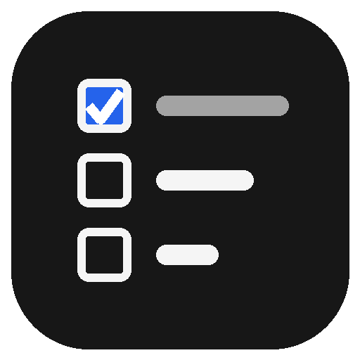

  

# projMan

Gestor de projetos e tarefas para uma pessoa só. Você organiza o seu trabalho em
projetos, quebra cada projeto em tarefas e acompanha tudo pelo navegador, no
computador ou no celular. Não há contas nem equipes: o app é seu, roda no seu
servidor e os dados ficam com você.

> **Versão 1.0.0** (2026-09-25). Estado do projeto e próximos passos:
> [`docs/proximosPassos.md`](docs/proximosPassos.md).

## O que você faz com ele

- **Projetos.** Crie, renomeie, reordene e dê cor a cada projeto. Arquive o que
  terminou: ele sai das listas, mas continua acessível.
- **Tarefas.** Título, descrição, prazo (dia inteiro ou com hora), prioridade de
  0 a 5, labels, comentários, anexos e subtarefas.
- **Recorrência.** Uma tarefa que se repete (a cada N dias, semanas, meses ou
  anos) avança sozinha para o próximo prazo quando você a marca como feita.
- **Três formas de ver um projeto.** **List** (ordem manual, arrastando),
  **Kanban** (colunas A fazer, Fazendo e Feito) e **Table** (colunas fixas,
  ordenáveis).
- **Smart lists.** Hoje, 7 dias, Atrasadas, Sem prazo e Todas as abertas, sobre todos os
  projetos.
- **Filtros salvos.** Monte uma lista com as suas regras (projeto, label,
  prioridade, prazo) e guarde-a na barra lateral.
- **Link público.** Mostre um projeto a outra pessoa, só para leitura, por um
  link que você pode revogar.
- **Calendário.** Assine o feed iCal no Google Calendar (Outras agendas → Por
  URL) ou em outro cliente: toda tarefa aberta com prazo vira um evento.
- **Arrastar no celular.** Na List e no Kanban, segure a alça de mover (as
  quatro setas) por um instante e arraste.
- **Tema claro e escuro**, e instalável como app (PWA): as páginas já abertas
  continuam legíveis sem rede.
- **Acesso com senha.** Uma senha só, a sua; **Sair** na barra lateral encerra a
  sessão do aparelho.
- **Seus dados.** Baixe tudo (banco e anexos) num arquivo `.tar.gz` a qualquer
  momento.

## Mais informação

- [Instalação e operação](docs/instalacao.md): UNRAID, variáveis de ambiente,
  backup, export, atualização.
- [Desenvolvimento](docs/desenvolvimento.md): como rodar localmente e onde
  está a documentação técnica.
