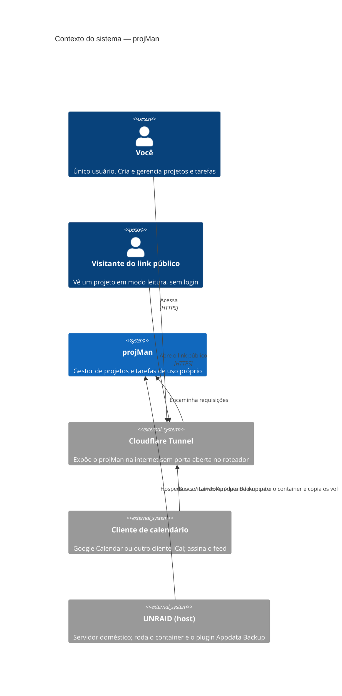
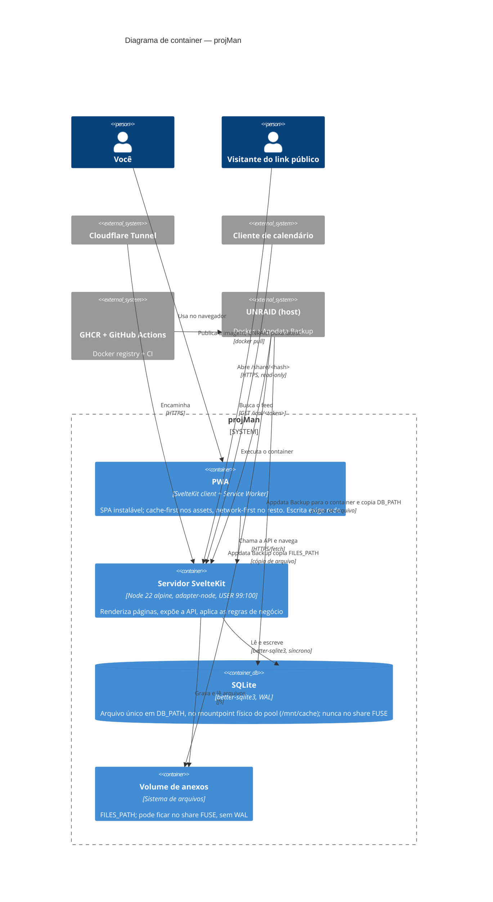
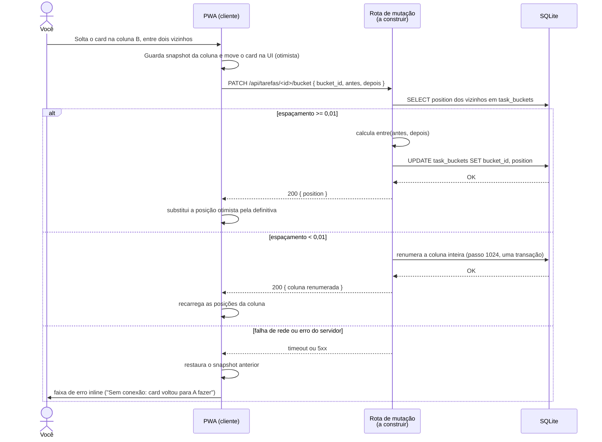

# Arquitetura — projMan

Modelo C4 (Context, Container, Component) mais um diagrama de sequência do
fluxo mais complexo do v1: mover um card no Kanban. Detalhe de cada decisão em
`docs/decisoes/NN-*.md`. Rationale técnico de cada escolha dura em `docs/adr/`.

## Nível 1 — Context

Projeto arquivado some das smart lists, dos filtros e do feed, mas continua
acessível pela sidebar numa seção "Arquivados" recolhida (`docs/decisoes/11-smart-lists-filtro.md`).

## Nível 2 — Container

Design visual: tema padrão do shadcn-svelte (base neutra), fonte do sistema,
sem tokens próprios no v1; claro/escuro por `prefers-color-scheme` mais
alternância manual guardada em `localStorage`. Anexo até 25 MB
(`BODY_SIZE_LIMIT=26214400`). Apagar é físico, sem lixeira; o projeto usa
`archived` como alternativa. i18n: só pt-BR, strings direto nos componentes.

## Nível 3 — Component (Servidor SvelteKit)

Estado do código nesta data: `(existe)` já está em `src/`; `(a construir)`
ainda falta. Confirmado por leitura direta dos arquivos.

```mermaid
C4Component
  title Diagrama de componentes — Servidor SvelteKit

  Container(pwa, "PWA", "SvelteKit client")
  ContainerDb(sqlite, "SQLite", "better-sqlite3")
  Container(anexos, "Volume de anexos", "fs")

  Container_Boundary(server, "Servidor SvelteKit") {
    Component(hook, "Hook", "src/hooks.server.ts", "(existe) Gate de sessão, headers de segurança, CSP, 405 em métodos de escrita no /share")

    Component(rotasLeitura, "Rotas de leitura", "+page.server.ts", "(parcial) /share/[hash] existe; List/Kanban/Table a construir")
    Component(rotasMutacao, "Rotas de mutação", "+server.ts", "(parcial) GET /api/tarefas existe; marcarFeita, mover card e CRUD de filtro salvo a construir")

    Component(db, "db.ts", "better-sqlite3", "(existe) Abre o banco, aplica pragmas WAL/busy_timeout/foreign_keys")
    Component(migrar, "migrar.ts", "SQL numerado + user_version", "(existe) Aplica migrações pendentes; grava <banco>.v<N>.bak antes de migrar banco em uso")
    Component(filtro, "filtro.ts", "TypeScript", "(existe) Valida filtro salvo/smart list, monta SQL parametrizado, pagina por cursor keyset")
    Component(datas, "datas.ts", "TypeScript", "(existe) Limites do dia por TZ, recorrência a partir do prazo anterior")

    Component(sanitize, "Sanitização", "sanitize-html", "(a construir) Sanitiza HTML na escrita; gera description_text para o FTS5")

    Component(sessao, "sessao.ts", "HMAC-SHA256", "(existe) Cria e valida o cookie de sessão sem estado, 30 dias")
    Component(senha, "senha.ts", "scrypt (N=131072,r=8,p=1)", "(existe) Hash e verificação da senha de admin")
    Component(limite, "limite.ts", "Map em memória", "(existe) Rate limit do login: 5 falhas por IP em 15 min")

    Component(exportar, "exportar.ts", "VACUUM INTO + tar.gz em stream", "(existe) Gera projman-AAAA-MM-DD.tar.gz com snapshot do banco e anexos referenciados")
    Component(ical, "ical.ts", "RFC 5545", "(existe) Gera o feed iCal das tarefas abertas com prazo")
    Component(orfaos, "Varredura de órfãos", "boot", "(a construir) Remove de FILES_PATH os arquivos sem linha em attachments")
    Component(saude, "GET /api/saude", "+server.ts", "(existe) Confirma schema aplicado e FILES_PATH gravável")
  }

  Rel(pwa, hook, "Toda requisição passa por aqui", "HTTPS")
  Rel(hook, sessao, "Valida o cookie")
  Rel(hook, rotasLeitura, "Libera se autenticado ou rota pública")
  Rel(hook, rotasMutacao, "Libera se autenticado")

  Rel(rotasLeitura, filtro, "Usa para listar")
  Rel(rotasLeitura, db, "Consulta")
  Rel(rotasMutacao, filtro, "Usa para listar")
  Rel(rotasMutacao, sanitize, "Sanitiza HTML recebido")
  Rel(rotasMutacao, datas, "Calcula recorrência e limites do dia")
  Rel(rotasMutacao, db, "Escreve")
  Rel(rotasMutacao, anexos, "Grava arquivo enviado")

  Rel(db, migrar, "Aplica migrações ao abrir")
  Rel(db, sqlite, "Conecta", "WAL")
  Rel(filtro, sqlite, "SELECT parametrizado")

  Rel(sessao, senha, "Login verifica a senha")
  Rel(sessao, limite, "Login checa e registra falhas")

  Rel(exportar, sqlite, "VACUUM INTO")
  Rel(exportar, anexos, "Lê os arquivos referenciados")
  Rel(ical, sqlite, "SELECT tarefas abertas com prazo")
  Rel(orfaos, sqlite, "Lista attachments válidos")
  Rel(orfaos, anexos, "Remove arquivos sem linha correspondente")
  Rel(saude, sqlite, "Lê user_version")
  Rel(saude, anexos, "Testa permissão de escrita")
```

`marcarFeita(task)` é o ponto único que escreve `done`, move o card em
`task_buckets` e trata a recorrência (`docs/decisoes/07-views-buckets.md`).
Nenhum outro caminho de escrita deve tocar essa coluna.

## Fluxo — mover card no Kanban (otimista, com rollback)

Ponto médio `REAL`, passo 1024, renumeração da coluna abaixo do limiar 0,01;
servidor calcula a posição a partir de `bucket_id` e dos vizinhos
(`docs/decisoes/16-kanban.md`). A rota de mutação do PATCH ainda está
**a construir**.

## Decisões de arquitetura

| ADR | Decisão |
|---|---|
| [0001-posicao-por-view.md](adr/0001-posicao-por-view.md) | Posição `REAL` por ponto médio, por view (List/Table) e por coluna (Kanban) — `docs/decisoes/07-views-buckets.md`, `16-kanban.md` |
| [0002-html-sanitizado-na-escrita.md](adr/0002-html-sanitizado-na-escrita.md) | `sanitize-html` roda na escrita, não na leitura — `docs/decisoes/09-schema.md` |
| [0003-senha-unica-por-env.md](adr/0003-senha-unica-por-env.md) | Um usuário, senha única via `ADMIN_PASSWORD_HASH`, sem tabela `users` — `docs/decisoes/10-autenticacao.md` |
| [0004-pwa-so-leitura.md](adr/0004-pwa-so-leitura.md) | PWA cacheia leitura; escrita sempre exige rede, sem motor de sync — `docs/decisoes/07-views-buckets.md` |
| [0005-anexos-fora-do-banco.md](adr/0005-anexos-fora-do-banco.md) | Anexo vive em `FILES_PATH`, banco guarda só o metadado — `docs/decisoes/09-schema.md` |
