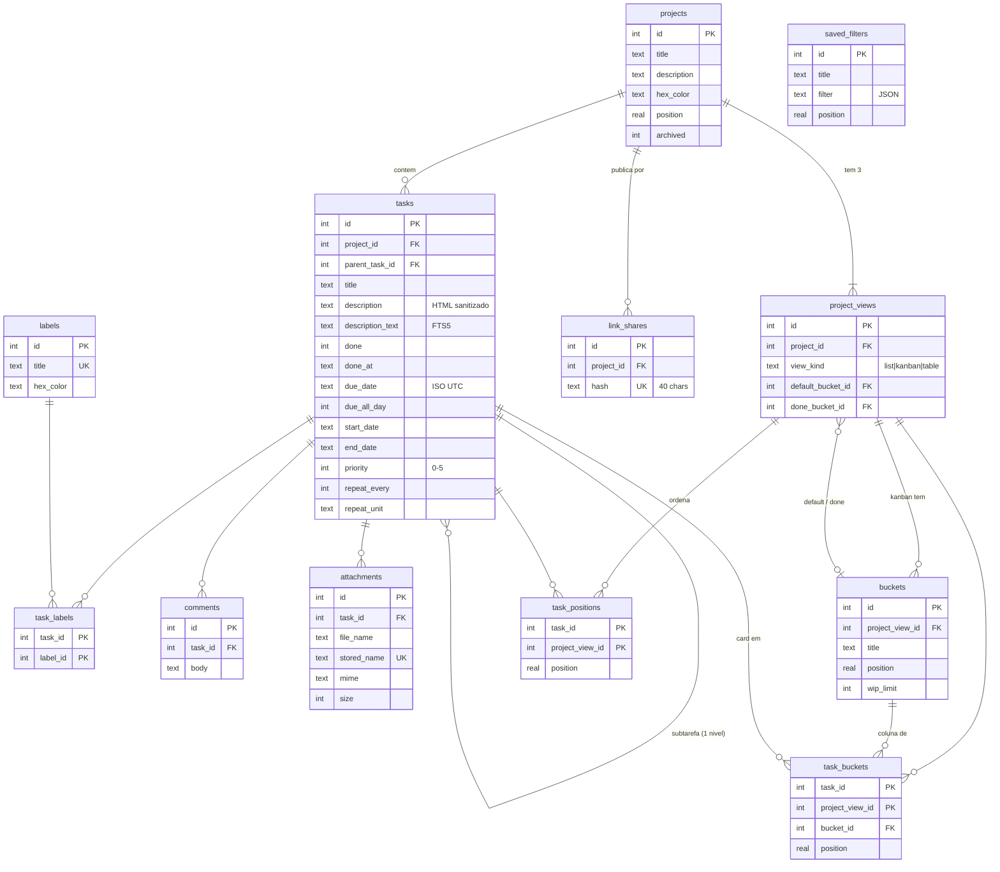

# #9 — Schema do SQLite

Decidido em 2026-09-22. Ticket [#9](https://github.com/edalcin/projMan/issues/9).
O DDL completo é a migração real: [`migrations/001_inicial.sql`](../../migrations/001_inicial.sql).

## Decisões

| # | Questão | Decisão |
|---|---|---|
| 1 | Identificador legível (`HERB-12`) | **Só o id numérico.** O `index` por projeto exige contador por projeto e cuidado com concorrência, para um usuário que clica, não digita IDs |
| 2 | Chaves estrangeiras | `ON DELETE CASCADE` em tudo que pende do projeto e da tarefa; `PRAGMA foreign_keys = ON` na abertura (desligado por padrão no SQLite) |
| 3 | Apagar | **Físico, sem lixeira.** O projeto tem `archived` para tirar da frente sem apagar; o export `.zip` é o backup. `deleted_at` obrigaria todo `SELECT` a lembrar de filtrar |
| 4 | Labels | **Globais**, título único sem distinção de maiúsculas |
| 5 | Enumerações | `CHECK` no banco: `priority` 0–5 (0 = sem), `view_kind`, `repeat_unit`, booleanos 0/1, `hash` de 40 chars, `filter` com `json_valid`, cor em hex minúsculo |
| 6 | `link_shares.permission` | **Coluna removida.** Read-only por construção: não há valor a errar |
| 7 | Subtarefas | `parent_task_id → tasks(id)`, **um nível só**, mesmo projeto. Triggers rejeitam neta, rejeitam tarefa com filhas virando subtarefa, e rejeitam mover mãe com filhas para outro projeto. Um nível elimina ciclo por construção — sem CTE recursiva |
| 8 | Sessão (R2) | **Nenhuma tabela.** Cookie HMAC (#3), rate limit em memória |
| 9 | Busca (R1) | `tasks_fts` FTS5 *external content* sobre `title` + `description_text`, `unicode61 remove_diacritics 2` (acha "herbario" em "herbário"), três triggers de sincronia |
| 10 | Projeto novo | Trigger cria as três views, as colunas A fazer / Fazendo / Feito, e liga `default_bucket_id` / `done_bucket_id` (#7) |
| 11 | Migrações | `PRAGMA user_version` + arquivos `NNN_nome.sql`, cada um numa transação; Vite embute os `.sql` no build |
| 12 | Colisão `limit` | A coluna de WIP é `wip_limit` (`limit` é palavra reservada) |

## Índices — cada um nasce de uma consulta

| Índice | Consulta |
|---|---|
| `tasks_abertas_prazo (due_date) WHERE done = 0` | Hoje, 7 dias, Atrasadas |
| `tasks_abertas_sem_prazo (created_at) WHERE done = 0 AND due_date IS NULL` | Sem prazo, Todas as abertas |
| `tasks_projeto (project_id, done)` | views de um projeto |
| `tasks_mae (parent_task_id)` parcial | subtarefas; triggers de nível |
| `task_buckets_coluna (bucket_id, position)` | cards de uma coluna em ordem |
| `task_positions_view (project_view_id, position)` | List/Table em ordem |
| `buckets_view`, `task_labels_label`, `comments_tarefa`, `attachments_tarefa`, `link_shares_projeto` | FKs do lado "muitos" |

## Diagrama

## Verificação

- `src/lib/server/schema.test.ts` (9 testes): três views + colunas ligadas no projeto novo, cascata ao apagar projeto, neta rejeitada, ciclo rejeitado, mãe noutro projeto rejeitada, `CHECK` da recorrência e do hash, FTS acompanhando edição e remoção e ignorando acento, migração idempotente.
- Imagem local (Alpine/musl) com volume: `/api/saude` → `schema v1`, arquivos WAL criados com dono `99:users`; reinício não reaplica a migração.

## Armadilha registrada

`better-sqlite3` v13 traz os binários de todas as plataformas **dentro do pacote**, mas
o npm ainda roda o `node-gyp rebuild` implícito porque existe `binding.gyp`. No
Alpine, sem Python, o `npm ci` falha. Solução: `npm ci --ignore-scripts` no
`Dockerfile` e no CI.

## O que ficou de fora e quando volta

- Identificador `HERB-12`: coluna `index` + contador por projeto, quando houver necessidade de citar tarefas por nome.
- Lixeira: `deleted_at` + varredura, se um apagar acidental doer. O export cobre até lá.
- Subtarefas em vários níveis: troca os triggers por CTE recursiva de ciclo.
